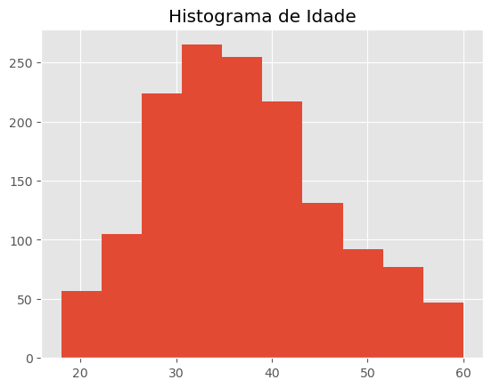
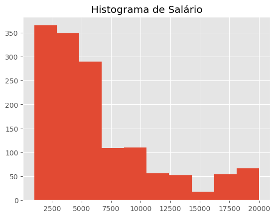
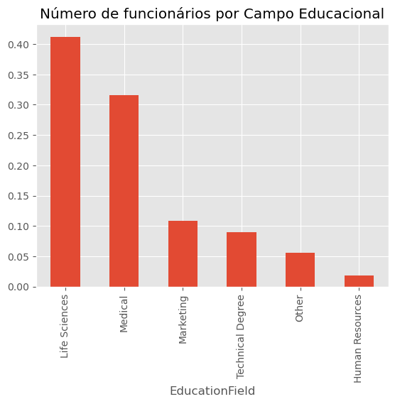
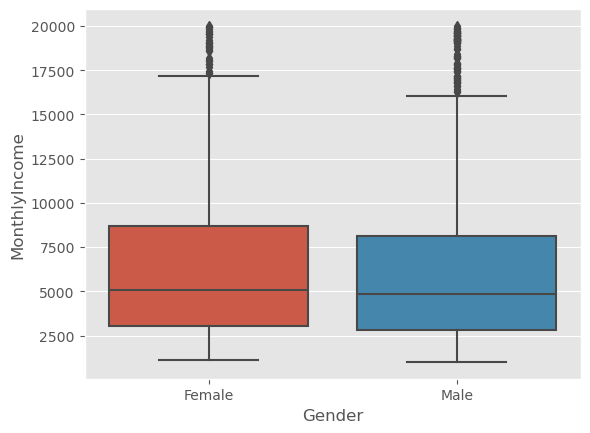

# Introdução

A análise abaixo foi feita utilizando dados provinientes do RH da empresa IBM que foram disponibilizados no site www.kaggle.com.

A minha motivação é entender o perfil das pessoas que deixam a empresa. Isso pode ser importante para previnir demissões, melhorar a satisfação dos colaboradores e diminuir os custos operacionais, o que como consequência, deve aumentar a produtividade da empresa.

Perguntas para responder com a análise:
- Existe diferença salarial entre homens e mulheres?
- Há alguma evidência em relação de que gênero impacta no atrito entre funcionário e empresa?
- Qual a relação entre salário e departamento em que o funcionário atua?

Fonte do dataset:
https://www.kaggle.com/datasets/pavansubhasht/ibm-hr-analytics-attrition-dataset

# 1. Carregando as bibliotecas


```python
import pandas as pd
import seaborn as sns
import numpy as np
import matplotlib.pyplot as plt

plt.style.use('ggplot')
```

# 2. Carregando Dataset


```python
df = pd.read_csv('analise-ibm-rh.csv')
```


```python
df.head()
```


<div>
<style scoped>
    .dataframe tbody tr th:only-of-type {
        vertical-align: middle;
    }

    .dataframe tbody tr th {
        vertical-align: top;
    }

    .dataframe thead th {
        text-align: right;
    }
</style>
<table border="1" class="dataframe">
  <thead>
    <tr style="text-align: right;">
      <th></th>
      <th>Age</th>
      <th>Attrition</th>
      <th>BusinessTravel</th>
      <th>DailyRate</th>
      <th>Department</th>
      <th>DistanceFromHome</th>
      <th>Education</th>
      <th>EducationField</th>
      <th>EmployeeCount</th>
      <th>EmployeeNumber</th>
      <th>...</th>
      <th>RelationshipSatisfaction</th>
      <th>StandardHours</th>
      <th>StockOptionLevel</th>
      <th>TotalWorkingYears</th>
      <th>TrainingTimesLastYear</th>
      <th>WorkLifeBalance</th>
      <th>YearsAtCompany</th>
      <th>YearsInCurrentRole</th>
      <th>YearsSinceLastPromotion</th>
      <th>YearsWithCurrManager</th>
    </tr>
  </thead>
  <tbody>
    <tr>
      <th>0</th>
      <td>41</td>
      <td>Yes</td>
      <td>Travel_Rarely</td>
      <td>1102</td>
      <td>Sales</td>
      <td>1</td>
      <td>2</td>
      <td>Life Sciences</td>
      <td>1</td>
      <td>1</td>
      <td>...</td>
      <td>1</td>
      <td>80</td>
      <td>0</td>
      <td>8</td>
      <td>0</td>
      <td>1</td>
      <td>6</td>
      <td>4</td>
      <td>0</td>
      <td>5</td>
    </tr>
    <tr>
      <th>1</th>
      <td>49</td>
      <td>No</td>
      <td>Travel_Frequently</td>
      <td>279</td>
      <td>Research &amp; Development</td>
      <td>8</td>
      <td>1</td>
      <td>Life Sciences</td>
      <td>1</td>
      <td>2</td>
      <td>...</td>
      <td>4</td>
      <td>80</td>
      <td>1</td>
      <td>10</td>
      <td>3</td>
      <td>3</td>
      <td>10</td>
      <td>7</td>
      <td>1</td>
      <td>7</td>
    </tr>
    <tr>
      <th>2</th>
      <td>37</td>
      <td>Yes</td>
      <td>Travel_Rarely</td>
      <td>1373</td>
      <td>Research &amp; Development</td>
      <td>2</td>
      <td>2</td>
      <td>Other</td>
      <td>1</td>
      <td>4</td>
      <td>...</td>
      <td>2</td>
      <td>80</td>
      <td>0</td>
      <td>7</td>
      <td>3</td>
      <td>3</td>
      <td>0</td>
      <td>0</td>
      <td>0</td>
      <td>0</td>
    </tr>
    <tr>
      <th>3</th>
      <td>33</td>
      <td>No</td>
      <td>Travel_Frequently</td>
      <td>1392</td>
      <td>Research &amp; Development</td>
      <td>3</td>
      <td>4</td>
      <td>Life Sciences</td>
      <td>1</td>
      <td>5</td>
      <td>...</td>
      <td>3</td>
      <td>80</td>
      <td>0</td>
      <td>8</td>
      <td>3</td>
      <td>3</td>
      <td>8</td>
      <td>7</td>
      <td>3</td>
      <td>0</td>
    </tr>
    <tr>
      <th>4</th>
      <td>27</td>
      <td>No</td>
      <td>Travel_Rarely</td>
      <td>591</td>
      <td>Research &amp; Development</td>
      <td>2</td>
      <td>1</td>
      <td>Medical</td>
      <td>1</td>
      <td>7</td>
      <td>...</td>
      <td>4</td>
      <td>80</td>
      <td>1</td>
      <td>6</td>
      <td>3</td>
      <td>3</td>
      <td>2</td>
      <td>2</td>
      <td>2</td>
      <td>2</td>
    </tr>
  </tbody>
</table>
<p>5 rows × 35 columns</p>
</div>


```python
# 3. Verificando a quantidade de linhas, colunas e tipos de dados
```


```python
df.info()
```

    <class 'pandas.core.frame.DataFrame'>
    RangeIndex: 1470 entries, 0 to 1469
    Data columns (total 35 columns):
     #   Column                    Non-Null Count  Dtype 
    ---  ------                    --------------  ----- 
     0   Age                       1470 non-null   int64 
     1   Attrition                 1470 non-null   object
     2   BusinessTravel            1470 non-null   object
     3   DailyRate                 1470 non-null   int64 
     4   Department                1470 non-null   object
     5   DistanceFromHome          1470 non-null   int64 
     6   Education                 1470 non-null   int64 
     7   EducationField            1470 non-null   object
     8   EmployeeCount             1470 non-null   int64 
     9   EmployeeNumber            1470 non-null   int64 
     10  EnvironmentSatisfaction   1470 non-null   int64 
     11  Gender                    1470 non-null   object
     12  HourlyRate                1470 non-null   int64 
     13  JobInvolvement            1470 non-null   int64 
     14  JobLevel                  1470 non-null   int64 
     15  JobRole                   1470 non-null   object
     16  JobSatisfaction           1470 non-null   int64 
     17  MaritalStatus             1470 non-null   object
     18  MonthlyIncome             1470 non-null   int64 
     19  MonthlyRate               1470 non-null   int64 
     20  NumCompaniesWorked        1470 non-null   int64 
     21  Over18                    1470 non-null   object
     22  OverTime                  1470 non-null   object
     23  PercentSalaryHike         1470 non-null   int64 
     24  PerformanceRating         1470 non-null   int64 
     25  RelationshipSatisfaction  1470 non-null   int64 
     26  StandardHours             1470 non-null   int64 
     27  StockOptionLevel          1470 non-null   int64 
     28  TotalWorkingYears         1470 non-null   int64 
     29  TrainingTimesLastYear     1470 non-null   int64 
     30  WorkLifeBalance           1470 non-null   int64 
     31  YearsAtCompany            1470 non-null   int64 
     32  YearsInCurrentRole        1470 non-null   int64 
     33  YearsSinceLastPromotion   1470 non-null   int64 
     34  YearsWithCurrManager      1470 non-null   int64 
    dtypes: int64(26), object(9)
    memory usage: 402.1+ KB
    

# 4. Analisando os dados

# Verificando a distribuição de idade


```python
_= plt.hist(df.Age)
_= plt.title("Histograma de Idade")
```


    

    


```python
_ = plt.hist(df.MonthlyIncome)
_ = plt.title("Histograma de Salário")
```


    

    


É possível observar uma assimetria na distribuição, o maior número de funcionários gira em torno de 30 a 40 anos. 

# Verificando a distribuição por gênero


```python
df.Gender.value_counts()
```


    Gender
    Male      882
    Female    588
    Name: count, dtype: int64


```python
df.Gender.value_counts(1)
```


    Gender
    Male      0.6
    Female    0.4
    Name: proportion, dtype: float64


# Verificando número de funcionários por Campo educacional


```python
df.EducationField.value_counts(1)
```


    EducationField
    Life Sciences       0.412245
    Medical             0.315646
    Marketing           0.108163
    Technical Degree    0.089796
    Other               0.055782
    Human Resources     0.018367
    Name: proportion, dtype: float64


```python
_ = df.EducationField.value_counts(1).plot.bar()
_ = plt.title("Número de funcionários por Campo Educacional") 
```


    

    

É possível observar que a maioria dos funcionários é formado na área de Life Sciences. Na sequência, temos muitos funcionários na área Medical. A área com menos funcionários formados é a de Human Resources. 
# Analisando variáveis


```python
_ = sns.boxplot(x='Gender', y='MonthlyIncome', data=df)
```


    

    


A distribuição salarial entre homens e mulheres é bem parecida. Normalmente, espera-se encontrar salários mais altos para homens. Porém, no caso da IBM, o isso parece não ocorrer.
